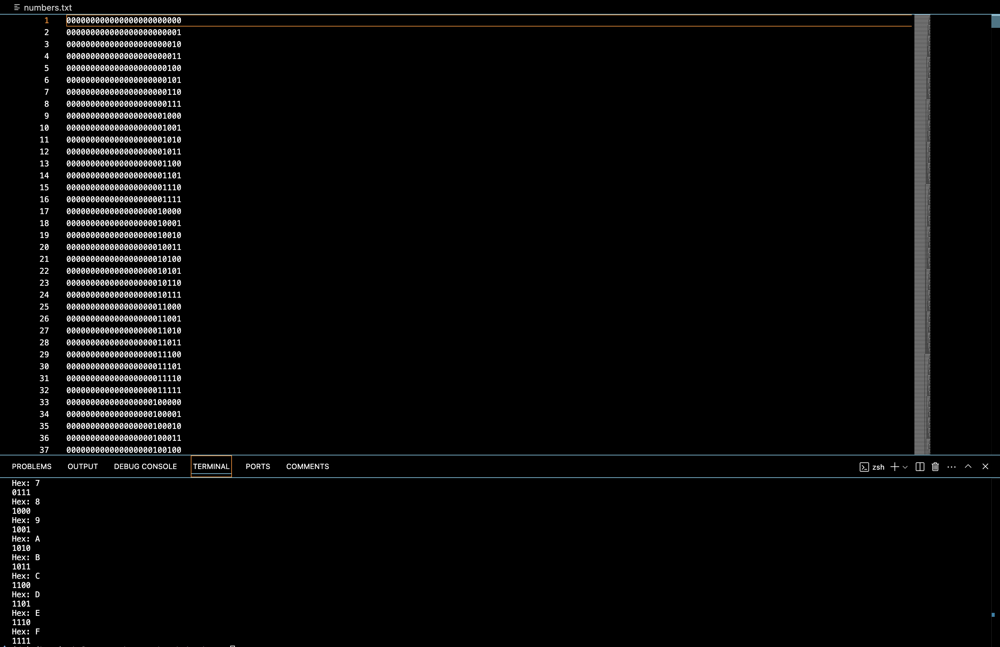

## PRIME FINDER:

Prime numbers may have a pattern in their binary form, which an AI model could elucidate using certain ML techniques.

# My goal is to guide the AI into uncovering these patterns, starting with a dataset of binary numbers from 0 to 16,777,216.

I am starting with a base dataset of numbers in binary, which is populated in numbers.txt

The following screenshot shows an example of how the data being processed will look:

Please take a look at attempts.ipynb for more details on how I will be applying ML.
